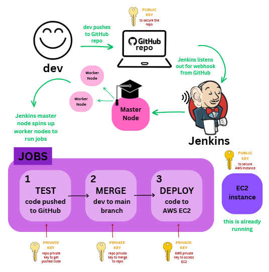
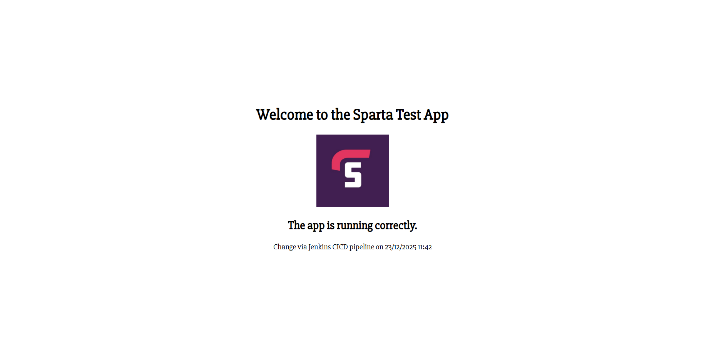
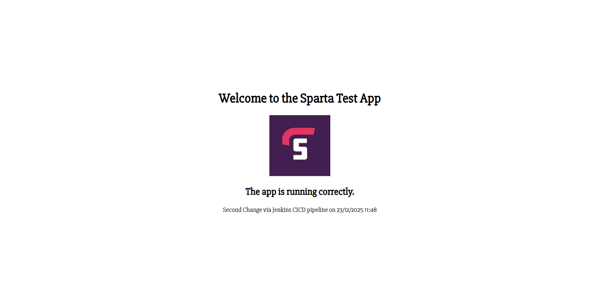

# CI/CD with Jenkins

🎯 Goal for CI/CD: Use Jenkins to automate the 2-tier app deployment

---

## Overview

This document describes the design and implementation of a 3-stage CI/CD pipeline using Jenkins to deploy a 2-tier Node.js application to AWS EC2

The pipeline automatically:
- Tests code pushed to the `dev` branch
- Merges tested code into `main`
- Deploys the application to an EC2 instance

The solution demonstrates best practices for automation, security, and branch protection using webhooks, SSH authentication and job chaining


<br>

---

## 📌 Table of Contents

- [CI/CD with Jenkins](#cicd-with-jenkins)
  - [Overview](#overview)
  - [📌 Table of Contents](#-table-of-contents)
  - [Session: Intro to CI/CD and Jenkins](#session-intro-to-cicd-and-jenkins)
    - [What is CI?](#what-is-ci)
    - [What is CD?](#what-is-cd)
    - [What is Jenkins?](#what-is-jenkins)
    - [Why use Jenkins?](#why-use-jenkins)
    - [Stages of Jenkins](#stages-of-jenkins)
      - [A Typical Jenkins CI/CD Pipeline](#a-typical-jenkins-cicd-pipeline)
    - [What Alternatives are there for Jenkins?](#what-alternatives-are-there-for-jenkins)
    - [Why Build a Pipeline?](#why-build-a-pipeline)
  - [Our CI/CD Pipeline Structure](#our-cicd-pipeline-structure)
    - [Pipeline Overview](#pipeline-overview)
    - [What Does a Successful Pipeline Do?](#what-does-a-successful-pipeline-do)
  - [Why This CI/CD Pipeline Design?](#why-this-cicd-pipeline-design)
    - [Why 3 Separate Jobs?](#why-3-separate-jobs)
    - [Why dev → main?](#why-dev--main)
    - [Why Webhooks Instead of Polling?](#why-webhooks-instead-of-polling)
    - [Why Jenkins Worker Nodes?](#why-jenkins-worker-nodes)
    - [Security Considerations](#security-considerations)
      - [SSH Authentication and Key Management](#ssh-authentication-and-key-management)
      - [Branch Protection and Automated Quality Gates](#branch-protection-and-automated-quality-gates)
  - [Code-along: Use Jenkins For the First Time](#code-along-use-jenkins-for-the-first-time)
    - [Overview](#overview-1)
    - [Setup](#setup)
  - [3-job Jenkins Pipeline to Deploy Sparta Test App](#3-job-jenkins-pipeline-to-deploy-sparta-test-app)
    - [How To Generate New Key Pair for Jenkins](#how-to-generate-new-key-pair-for-jenkins)
    - [Job 1](#job-1)
      - [How To Set Up Job 1](#how-to-set-up-job-1)
      - [Job 1 Outcome](#job-1-outcome)
    - [Job 2](#job-2)
      - [How To Set Up Job 2](#how-to-set-up-job-2)
      - [Job 2 Outcome](#job-2-outcome)
    - [Job 3](#job-3)
      - [How To Set Up Job 3](#how-to-set-up-job-3)
      - [Job 3 Outcome](#job-3-outcome)
      - [Pipeline Result](#pipeline-result)
  - [Links to using SSH authentication with a repo on GitHub](#links-to-using-ssh-authentication-with-a-repo-on-github)

<br>
<br>

---

## Session: Intro to CI/CD and Jenkins


### What is CI?
- continuous integration
- automatically merging code
- Triggered by:
  - Developers frequently pushing their code changes to a shared repository - this triggers CI/CD pipeline 
- tests are run automatically on the code before it is integrated into the main code

➕
- tests are run which helps you to identify and resolve bugs
    - detects problems early and frequently (unlike waterfall method)
  - reduces cost
  - helps to maintain a stable and functional software build

<br>

---

### What is CD?

Can mean:

1️⃣ **continuous delivery** (manual sign off/ approval)
      
  - ensures software is always in a deployable state, ready/ can be pushed production any time
  - often involves producing deployable artifact (saved somewhere and waiting to be deployed)
  - **requires manual approval / release decision**
  
<br>

 ➕ a deployable artifact is always ready and just needs manual approval to be deployed to end users
 
<br>

2️⃣ **continuous deployment** (automatically deploys code to production)
  - extends continuous delivery by automating the final step of deploying to production
  - **no manual intervention required**
  
<br>

 ➕ benefit which is also a disadvantage:
    - removes need for human approval but relies entirely on automated processes
  
<br>

---

### What is Jenkins?
- automation server
- open-source
- primarily used for CI/CD, but it can automate much more

<br>

---

### Why use Jenkins?

➕
- automate entire CI/CD pipeline
- reduces human error
- extensibility: Jenkins has 2000+ plug-ins that can support wide range of tools
- scalability: Jenkins server can scale easily by adding/using worker nodes or agents to run builds/ tests
- community support
- cross-platform: Windows, Linux, MacOS

➖
- complex setup for beginners 
- maintenance overhead: plug-ins and versions - getting to work and updating
- resource intensive when running multiple jobs
- user interface may be a little outdated, compared to modern tools

<br>

---

### Stages of Jenkins

#### A Typical Jenkins CI/CD Pipeline

🎭 **stages**
1. Source Code Management (SCM) usually from git
2. Build: compile the code, build into executable artifact
3. Test: automated tests are run (unit tests, integration tests, etc)
4. Package: into deployable artifact
5. If using continuous deployment then the package is deployed into target environment .e.g test, production
6. Monitor: monitoring tools may need to be deployed and configured by pipeline, to observe performance, log issues, etc after deployment

<br>

---

### What Alternatives are there for Jenkins?

- GitLab CI
- GitHub Actions
- CircleCI
- Travis CI
- Bamboo
- TeamCity
- GoCD
- Azure DevOps (Azure Pipelines)

<br>

---
  
### Why Build a Pipeline?

- faster time to market
- cost savings - automating repetitive processes
- reduced risk - catches things that will cause deployment failures
- developers can focus on writing code and developing/testing features, rather than deploying it
- scalability
- improved quality - catching bugs and fixing them early - end users get artifact earlier and can suggest improvements

<br>

---

## Our CI/CD Pipeline Structure

### Pipeline Overview



⚙️ **What Does the Developer Do?**
- Pushes their code to **dev branch**

⚙️ **What Does GitHub Do?**
- Sends a **notification webhook** to Jenkins
  
🔒 public key required to secure the GitHub repository

⚙️ **What Does Jenkins Do?**
- **Receives webhook** from GitHub
- Made up of master node - uses agent/worker nodes to actually carry out the jobs
- The master node (built-in node / server) spins up (delegates) agent nodes that run **3 jobs:**

<br>

🔹 CI = Jobs 1 & 2

🔹 CD = Job 3

<br>

1️⃣ **TEST**

- Pulls latest code from dev branch
- Code tested on Jenkins worker node
  
🔑 private key required to access the GitHub repository

2️⃣ **MERGE**

- Worker node checks out main branch
- New tested code **merged from dev branch to main branch**
- Main branch pushed to GitHub

🔑 private key required to merge to the GitHub repository

3️⃣ **DEPLOY**

- Tested code from the worker node is **copied into the EC2 instance**
- ssh into EC2 instance and start app

🔑 private key required to ssh into AWS EC2


⚙️ **What Does AWS EC2 Do?**
- An AWS EC2 is already running with all Sparta app dependencies

🔒 public key required to secure AWS EC2

<br>

---

### What Does a Successful Pipeline Do?

✅ Success

- Tests pass → pipeline continues
- Tests fail → pipeline stops ❌
- 💡 This prevents broken code ever reaching main or AWS

<br>

---

## Why This CI/CD Pipeline Design?

### Why 3 Separate Jobs?

- Separation of concerns
- Fail fast
- Easier debugging
- Clear CI vs CD boundary

<br>

---

### Why dev → main?

- Protects production-ready branch
- Prevents untested code deployment
- Matches real-world Git workflows

<br>

---

### Why Webhooks Instead of Polling?

❌ Polling = Jenkins keeps asking GitHub “any changes?”
✅ Webhook = GitHub tells Jenkins immediately when code has been pushed to GitHub

- Immediate feedback
- Reduced Jenkins load
- Industry best practice

<br>

---

### Why Jenkins Worker Nodes?

⭐ we use worker nodes instead of built-in nodes

- built-in nodes are simpler than having worker nodes and so make it easier to get started with Jenkins

BUT unlike worker node

- built-in nodes cannot scale up on demand
- if built-in nodes crash, no more CI/CD pipelines can be run
- with built-in nodes, any builds will have the same level of access to the file system as the Jenkins process

➕ Worker Nodes

- Scalability 
- Fault isolation
- Security separation

<br>

---

### Security Considerations

#### SSH Authentication and Key Management

We Have Separate SSH keys for:

1️⃣ GitHub access

  - Allows Jenkins to pull, merge, and push code to the repository  
  - Public key is stored in the GitHub repository as a deploy key  
  - Private key is securely stored in Jenkins Credentials Manager

2️⃣EC2 access

  - Allows Jenkins to securely connect to the EC2 instance for deployment  
  - Public key is stored in AWS EC2
  - Private key is stored securely in Jenkins and never committed to source control

<br>

#### Branch Protection and Automated Quality Gates

- Developers push changes only to the **`dev` branch**
- **Automated tests (Job 1)** act as a quality gate
- Code is merged into **`main` only if tests pass**
- This prevents:
  - Untested code reaching production-ready branches
  - Human error during manual merges

<br>

---

## Code-along: Use Jenkins For the First Time

### Overview
- Jenkins server is running
- No jobs yet
- Once a job runs, it is called a build
- Each job = a Jenkins project
- Linked jobs together = a pipeline

<br>

---

### Setup
1. sign into Jenkins server
   - Server 2
   - Default address for Jenkins server 2: http://52.31.15.176:8080
   - Login details:
     - Username: devopslondon
     - Password: DevOpsAdmin

2. create first job

    new item > name:lucy-first-project > freestyle project > ok to get to configure page for the project > General >
    add description:testing jenkins > discard old builds > Max # of builds to keep: 5 > Build steps > pick execute shell > uname -a > save at the bottom

    


3. build manually:
- Click Build Now
- Green tick = success
  Dashboard view:

  

- Job runs on a worker EC2 node

4. check console output

    
    

5. create a second job

   1. Copy existing job as a template > Name: lucy-get-date-time > Build step: `date`

    OR

   2. new item > name:lucy-get-date-time > freestyle project > ok to get to configure page for the project > General >
   add description:testing jenkins > discard old builds > Max # of builds to keep: 5 > Build steps > pick execute shell > date > save at the bottom

6. connect jobs 1 and 2

    **Why?**

    - to control execution order
    - to stop the pipeline if something fails

    **How?**

    lucy-first-project > configure > post build actions > build other projects > lucy-get-date-time (remove comma) >trigger only if build stable > save > click build now > check on dashboard


<br>

---

## 3-job Jenkins Pipeline to Deploy Sparta Test App

### How To Generate New Key Pair for Jenkins

1. create an ssh key pair

    In Git Bash:
      
    ```
        cd .ssh/

        ssh-keygen -t rsa -b 4096 -C "lucyannestevenson7@gmail.com"

        name it: lucy-jenkins-2-github-key

      press enter on these:
          - Enter passphrase for "lucy-github-key" (empty for no passphrase):
          - Enter same passphrase again:

    ```

2. add public key to app repo in GitHub

    go to app repo > settings > deploy keys > add > add public key name > cat lucy-jenkins-2-github-key.pub to get 'key' to fill in > tick allow write access 

    


**This Allows Jenkins to:**
- Pull code
- Merge branches
- Push updates back to GitHub

**How Does This Fit into My Pipeline?**
- Job 1: Uses this key to clone and test the repo
- Job 2: Uses this key to merge dev → main

<br>

---

### Job 1

🎯 Goal - Automatically run tests every time code is pushed to the dev branch

#### How To Set Up Job 1

1. make new project for job 1 on Jenkins

- Jenkins > click new item > name: lucy-sparta-app-job1-ci-test > click freestyle project > click ok > general > github project tick > https://github.com/lucystevenson/tech515-sparta-test-app-cicd.git but remove '.git' and replace with / like https://github.com/lucystevenson/tech515-sparta-test-app-cicd/ > source code management > click git > URL: git@github.com:lucystevenson/tech515-sparta-test-app-cicd.git (make sure this is SSH not HTTPS)> add credential > add > jenkins > kind: ssh username with private key > id&username: lucy-jenkins-2-github-key > description: to read/write to repo > private key > enter directly (cat lucy-jenkins-2-github-key in github - copy and paste)> add > then add this key to credentials drop down > branch > set default branch to */main > build environment > click provide node & npm bin/ folder to PATH > specify NodeJS version 20 > build steps > select execute shell > we are now in github repo > add 

  ```
  cd app
  npm install
  npm test
  ```

  

  authenticate with ssh GitHub link
  


2. Setup the webhook to trigger Job 1

**Why Are We Using a Webhook?**
- Instead of Jenkins constantly checking GitHub (polling)
- GitHub notifies Jenkins instantly when code is pushed

**How?**
1. get Jenkins to listen to webhook:

    On Jenkins:
    lucy-sparta-app-job1-ci-test > configure > build triggers > click 'GitHub hook trigger for GITScm polling' > save

    

2. set up notification to be sent on GitHub repo to Jenkins

    on GitHub add webhook pointing to http://<jenkins-ip>:8080/:

    settings > webhooks > add webhooks > payload URL: http://52.31.15.176:8080/github-webhook/ > add


    

3. test webhook in Git Bash 
    ```
      18  cd Documents/github/
      19  ls
      20  cd tech515-sparta-test-app-cicd/
      21  ls
      22  nano README.md
      23  git add .
      24  git commit -m "add line to README"
      25  git push
    ```

#### Job 1 Outcome

- Developer pushes code to GitHub
- GitHub sends a webhook
- Jenkins runs Job 1 automatically
- Tests pass or fail immediately

<br>

---

### Job 2

🎯 Goal - Automatically merge the dev branch into the main branch, only if Job 1 succeeds

**What Has Already Happened in Job 1?**

We have taken files that have been pushed to GitHub on the dev branch and tested the files on a worker node

**How Does Job 2 Link To Job 1?**

Only when that job 1 is successful, we build job 2 that checks out the main branch and merges the new tested code from the dev branch to the main branch and pushes this to GitHub

❌
- We don't need a webhook here - we will set up job 2 so it automatically builds after job 1 - NO need to tick 'GitHub hook trigger for GITScm polling' for job 2 as we are already listening for a webhook on job 1 > if we add this here, job 2 will also be listening out for a webhook from GitHub and if we push a change to GitHub, job 2 will be triggered unnecessarily

- build environment > click provide node & npm bin/ folder to PATH > NO need to tick this on job 2 as we have already npm install in job 1


**Why We Did This**
- Protects the main branch
- Ensures only tested code is merged
- Removes the need for manual merges

**Problem it Solves:**
- Human error during merging
- Untested code reaching production-ready branches

#### How To Set Up Job 2

1. make project for job 2 on Jenkins

   - Jenkins > click new item > name: lucy-sparta-app-job2-ci-merge> click freestyle project > click ok

   - general > GitHub project tick > https://github.com/lucystevenson/tech515-sparta-test-app-cicd.git but remove '.git' and replace with / like https://github.com/lucystevenson/tech515-sparta-test-app-cicd/ > source code management > click git > URL: git@github.com:lucystevenson/tech515-sparta-test-app-cicd.git (make sure this is SSH not HTTPS)> add credential > drop down > select lucy-jenkins-2-github-key > branch > set default branch to */dev

   - build environment > click SSH agent > add credentials 'lucy-jenkins-2-github-key' 
     - this loads your GitHub SSH private key into the job and enables Jenkins to write to the repo so it can do the git commands below

   - build steps > select execute shell > we are now in GitHub repo > add 

    ```
    git fetch origin
    git checkout main
    git pull origin main
    git merge origin/dev
    git push origin main

    ```

   **What These Commands Do**
   - git fetch origin → updates all remote branches (origin/dev, origin/main, etc.)
   - git checkout main → make sure you’re on main locally
   - git merge origin/dev → merge the latest dev from GitHub into your local main
   - git push origin main → push the updated main back to GitHub

   > alternative - Jenkins Git Publisher plugin could be used instead of shell commands

    **How to Add Git Publisher Plugin?**
    
      Post build actions > add > git publisher > click 'push only if build succeeds', 'merge results' > branches > branch to push: main > target remote name: origin > save > make sure to remove shell commands now

        
      


2. connect jobs 1 and 2

    **Why?**

    - Job 2 should only run if tests pass and build is stable

    **How?**

    - Dashboard > lucy-sparta-app-job1-ci-test > configure > post build actions > build other projects > lucy-sparta-app-job2-ci-merge (remove comma) >trigger only if build stable > save > click build now > check on dashboard

3. check job 1 and job 2 work

   - Create and switch to dev branch locally
   - Make a change and push to GitHub

   In Git Bash:
   ```
      27  git branch dev
      28  git switch dev
      29  nano README.md (add line here)
      30  git add .
      31  git commit -m "add line to README"
      32  git push
   ```

#### Job 2 Outcome

- GitHub webhook triggers Job 1
- Job 1 runs tests
- If successful, Job 2 runs
- dev is merged into main

<br>

---

### Job 3

🎯 Goal for job 3 - copying the already-tested code that exists in the Jenkins workspace to your EC2 instance and running app ec2 instance

**What Has Already Happened in Jobs 1 and 2?**

We have taken files that have been pushed to GitHub on the dev branch, tested the files on a worker node and then, only when that is successful, we check out the main branch and merge the new code from the dev branch to the main branch and push this to GitHub. We need to take the tested code from the worker node and copy this into the EC2 instance, then ssh into EC2 instance and run commands to start up our Sparta app


#### How To Set Up Job 3

1. create an AWS EC2 instance

- Sparta test app using Node JS 20 needs Ubuntu 22.04 LTS
- Use normal SG rules, but allow from anywhere (to get it working initially) OR Jenkins worker nodes SG to allow Jenkins to SSH in (for better security):
security group should have these inbound rules:


- must have all dependencies / user data installed to run your app:

```
#!/bin/bash

# Update system
sudo apt update -y
sudo DEBIAN_FRONTEND=noninteractive apt upgrade -yq

# Install Nginx
sudo apt install -y nginx
sudo systemctl enable nginx
sudo systemctl start nginx

# Install Node.js 20
curl -fsSL https://deb.nodesource.com/setup_20.x | sudo -E bash -
sudo apt install -y nodejs

# Install PM2 globally
sudo npm install -g pm2
```

2. make project for job 3

- Jenkins > click new item > name: lucy-sparta-app-job3-cd-deploy> click freestyle project > click ok

- general > GitHub project tick > https://github.com/lucystevenson/tech515-sparta-test-app-cicd.git but remove '.git' and replace with / like https://github.com/lucystevenson/tech515-sparta-test-app-cicd/ 

- source code management > tick git > URL: git@github.com:lucystevenson/tech515-sparta-test-app-cicd.git > Credentials: lucy-jenkins-2-github-key > Branch: */main

⚠️ This is mandatory — every job that needs files must check out the repo

- build environment > click SSH agent > credentials > add > jenkins > kind: SSH username with private key > description: private key to SSH into EC2 instance > username: tech515-lucy-aws.pem > private key > enter directly > copy and paste private key in > add > then select private key you have just added 'tech515-lucy-aws.pem'
  - we do this as we need to add the private key credentials on Jenkins for Job 3 to access our EC2 instance

- build steps > select execute shell >
  - this copies the tested code from Jenkins worker node to ec2 instance, then we ssh into the ec2 instance and run the app

I originally tried this code:

```
rsync -av --delete . ubuntu@<EC2_PUBLIC_IP>:/home/ubuntu/sparta-test-app

ssh ubuntu@<EC2_PUBLIC_IP> << 'EOF'
  cd /home/ubuntu/app
  npm install
  pm2 stop app.js
  pm2 start app.js
EOF
```

but I came across a blocker - I needed to stop Strict Host Key Checking so I updated my code to this:

```
rsync -av --delete -e "ssh -o StrictHostKeyChecking=no" \
  ./ ubuntu@3.254.77.197:/home/ubuntu/app/

ssh -o StrictHostKeyChecking=no ubuntu@3.254.77.197 << 'EOF'
  cd /home/ubuntu/app/app
  npm install
  pm2 restart all || pm2 start app.js
EOF
```

>**Why is `rsync` Better Than `scp`?**
>
>rsync is better than scp because it only transfers changed files, whereas scp copies everything unnecessarily

1. connect jobs 2 and 3

    **Why?**

    - Job 3 should only run if job 2 works and build is stable

    **How?**

    - lucy-sparta-app-job2-ci-merge > Configure > add post-build Actions > Build other projects > projects to build > add lucy-sparta-app-job3-cd-deploy > Trigger only if build is stable > save

2. test pipeline

In Git Bash:

`cd tech515-sparta-test-app-cicd/` should be on dev branch

cd into views folder

`cd app/views/`

update line 'Change via Jenkins CI/CD pipeline on 16/12/25 12:25' in 'index.ejs' file with current time:

`nano index.ejs`


push change to GitHub

```
git add . stage change
git commit -m "change front page 9:22"
git push
```

#### Job 3 Outcome

- rsync code → EC2
- ssh into EC2
- install deps (if needed)
- restart app (pm2 / node)

#### Pipeline Result

Every time we change the app text and push the change to our GitHub repo, our Jenkins pipeline will be triggered and the front page of our app will be updated with the change we made in our code:

change 1




change 2



<br>

---

## Links to using SSH authentication with a repo on GitHub
* Link to [SSH doc](SSH/README.md)

