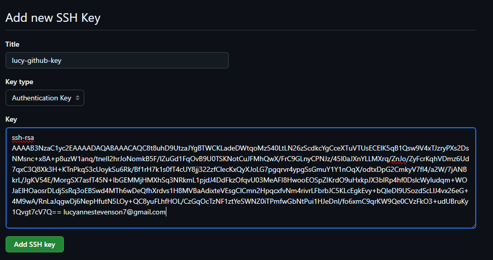
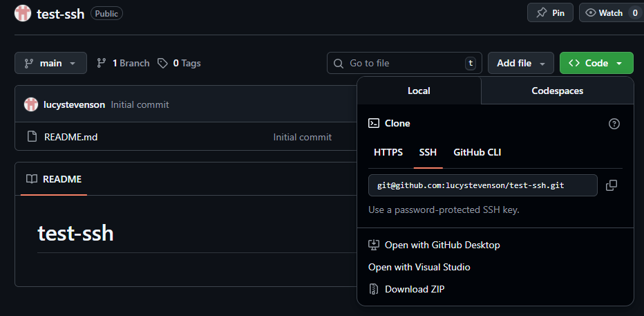

# SSH

## Code-along: Use SSH authentication with a repo on GitHub

**To Do**
- create a repo on github by adding a repository
- push new folder to github using: `git push -u origin main`
- We want our git repo to be on github
- then we have repo on local machine and github repo synced together

**How?**

1. we need to create an ssh key pair

     - we already have one we generated using aws
     we were given private key and downloaded it to our files
     the public key was stored on aws

     - we also generated a key pair for gcp - you can generate it manually on loacl machine
     
   ```
       cd .ssh/

       ssh-keygen -t rsa -b 4096 -C "lucyannestevenson7@gmail.com"

       name it: lucy-github-key
   ```
   - makes it 4096 bites long so it's hard to crack
       - press enter on these:
         - Enter passphrase for "lucy-github-key" (empty for no passphrase):
         - Enter same passphrase again:

2. add public key to github to secure things
    we want it to authenticate any repo stored on our github

   - go over to github to register padlock

     Icon > settings > SSH & GPG keys > on git bash cat SSH
     lucy-github-key.pub > copy and paste this onto github
     

3. register/ add private key to SSH register

   - we need to run a process called ssh agent - it will show a process id if done correctly

        ```
        cd .ssh/
        eval `ssh-agent -s`
        ```

        output `Agent pid 1276`

        ```
        ssh-add lucy-github-key
        ```

        output `
        Identity added: lucy-github-key (lucyannestevenson7@gmail.com)`

   - test connection to github
        ```
        ssh -T git@github.com
        ```

        output 

        ```
        The authenticity of host 'github.com (20.26.156.215)' can't be established.
        ED25519 key fingerprint is: SHA256:+DiY3wvvV6TuJJhbpZisF/zLDA0zPMSvHdkr4UvCOqU
        This key is not known by any other names.
        Are you sure you want to continue connecting (yes/no/[fingerprint])? yes
        Warning: Permanently added 'github.com' (ED25519) to the list of known hosts.
        Hi lucystevenson! You've successfully authenticated, but GitHub does not provide shell access.
        ```
4. create a test repo

   - create repo in github called test-ssh
   - git clone to sync to local 
   - copy ssh endpoint:
   

   - go to and do
   cd Documents/github/ in git bash
   git clone git@github.com:lucystevenson/test-ssh.git

     ‼️ this is not a permanent change - you can switch to using HTTPS here

5. push changes to test repo

      ```
        60  nano README  (add anythin gere - just testing)
        61  git status
        62  git add .
        63  git commit -m "Update README"
        64  git push
      ```


🧠 Why?

- Private key → stays on your machine 🔒
- Public key → added to GitHub
- SSH lets GitHub verify it’s you without passwords